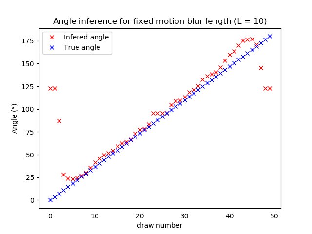
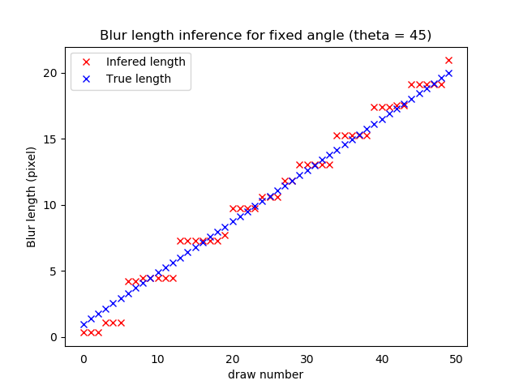

[](https://github.com/luczeng/MotionBlur/actions)

# Description
This project aims at removing motion blur originating from the motion or shake of hand-held cameras. It aims to work blindly, ie no knowledge of the blur is required. The motion blur is estimated using a convolutional neural network, and is later used to calibrate a deconvolution algorithm.  

The project consists of two distinct parts:    
	- the image processing section, with the deconvolution algorithms and the forward models.  
	- the blur estimation section using a neural network.  

See the [wiki](https://github.com/luczeng/MotionBlur/wiki) for some visual insights.  

The library is coded in Python3.

Contributions are more than welcome, either on on the image processing (modeling of complex blurs) or the blur estimation.

# News
- As of May 2020, the project restarts! We move from tensorflow to pytorch. We will extend the motion blur models to more complicated motions than simply linear movements. We will also tackle the space variant case. We plan to extend to TV deblurring. 

# Progress
- As of now (May 2020), we support deblurring of *linear blurs* using a Wiener filter.

# Installation
In your favorite conda environment, type:  
  
~~~
    pip install -e .
~~~

For development, install the test libraries as follow:

~~~
    pip install -e .[TEST_SUITE]
~~~

# Implementation
- The linear kernel is obtained by integrating a line over one pixel so as to take into account discretization effects.
- The deconvolution is a Wiener filter. We plan to add a TV deconvolution.
- Data and training:  WIP

# Usage
- For inference, edit or copy the configuration file in libs/configs run:  
 
```
    python driver_scripts/main_inference.py -i path_to_config.yml
```
- Training: wip

# Performance
- Visual performance of the linear motion blur regression (latest results):

|             | 
| ------------- |:-------------:|


